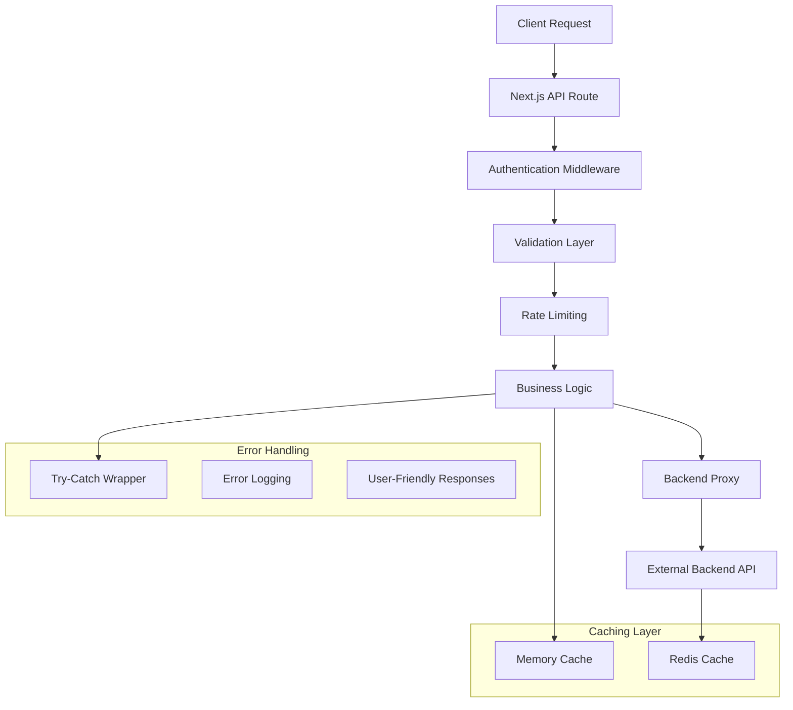
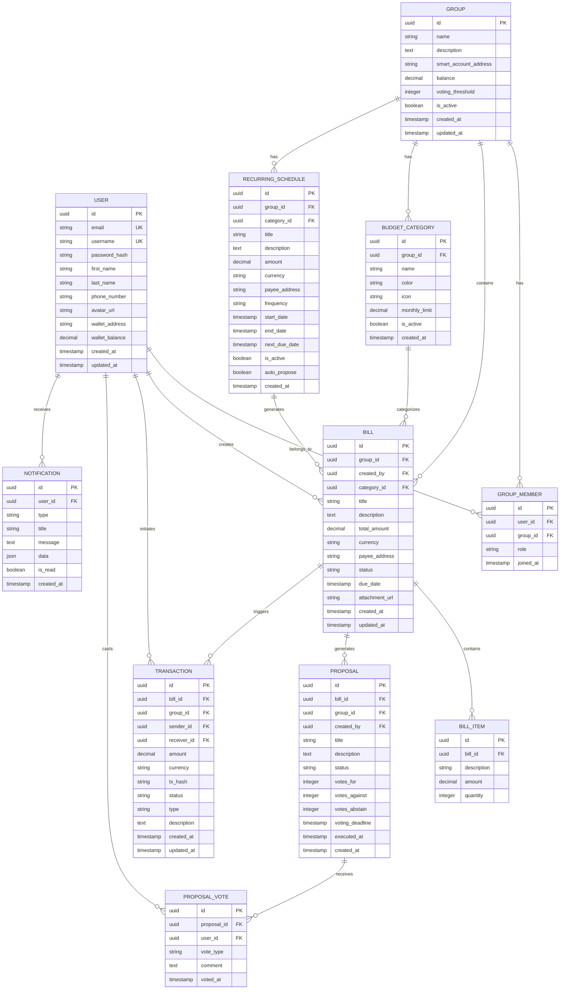

# Roomy Frontend - Complete API Implementation Architecture

## 1. Architecture Design

```mermaid
graph TD
    A[User Browser] --> B[Next.js Frontend Application]
    B --> C[API Route Handlers]
    C --> D[Backend Proxy Layer]
    D --> E[Roomy Backend Service]
    C --> F[Local Authentication Layer]
    C --> G[Validation & Error Handling]
    
    subgraph "Frontend Layer"
        B
        H[Zustand State Management]
        I[React Components]
        J[Openfort SDK Integration]
    end
    
    subgraph "API Layer (Next.js)"
        C
        F
        G
        K[Rate Limiting]
        L[CORS Handling]
    end
    
    subgraph "Backend Integration"
        D
        E
        M[Database (PostgreSQL)]
        N[Blockchain Integration]
    end
    
    B --> H
    B --> I
    B --> J
    E --> M
    E --> N
```

## 2. Technology Description

- Frontend: Next.js 16 + React 18 + TypeScript + Tailwind CSS + Zustand
- API Layer: Next.js API Routes with TypeScript
- Backend Integration: RESTful API proxy to https://roomy-6zsa.onrender.com/api
- Authentication: JWT tokens with cookie-based session management
- Blockchain: Openfort SDK for wallet operations
- State Management: Zustand for client-side state
- Validation: Zod for runtime type validation
- Database: PostgreSQL (via backend service)

## 3. Route Definitions

| Route | Purpose | Implementation Status |
|-------|---------|----------------------|
| /api/auth/* | Authentication endpoints | ✅ Partially Complete |
| /api/users/* | User management | ❌ Missing |
| /api/groups/* | Group management | ⚠️ Partially Complete |
| /api/bills/* | Bill management | ⚠️ Partially Complete |
| /api/proposals/* | Proposal management | ⚠️ Partially Complete |
| /api/transactions/* | Transaction management | ⚠️ Partially Complete |
| /api/budget/* | Budget and categories | ❌ Missing |
| /api/recurring/* | Recurring bills | ⚠️ Partially Complete |
| /health/* | Health check endpoints | ❌ Missing |

## 4. API Implementation Plan

### 4.1 Missing Endpoints Priority Matrix

**Priority 1 (Critical - Core User Experience)**
- User Profile Management (`/api/users/profile`)
- Advanced Group Operations (`/api/groups/:id`, `/api/groups/:id/members`)
- Individual Bill Operations (`/api/bills/:id`)
- Individual Proposal Operations (`/api/proposals/:id`)

**Priority 2 (Important - Enhanced Functionality)**
- User Notifications (`/api/users/notifications`)
- Group Invitations (`/api/groups/:id/invite`, `/api/groups/:id/join`)
- Budget Categories (`/api/budget/*`)
- Advanced Authentication (`/api/auth/refresh`, `/api/auth/change-password`)

**Priority 3 (Nice to Have - Advanced Features)**
- Wallet Management (`/api/users/wallet`)
- Health Checks (`/health/*`)
- Password Reset Flow (`/api/auth/forgot-password`, `/api/auth/reset-password`)

### 4.2 Implementation Architecture by Category

#### User Management Endpoints (`/api/users/*`)

**Technical Approach:**
- Proxy pattern to backend service
- JWT token validation middleware
- Profile data caching in Zustand store
- File upload handling for avatars

**Key Endpoints:**
```typescript
// GET /api/users/profile
export async function GET(request: NextRequest) {
  const authToken = getAuthToken(request);
  const response = await fetchWithAuth(`${API_BASE_URL}/users/profile`, {
    headers: { Authorization: `Bearer ${authToken}` }
  });
  return NextResponse.json(response);
}

// PUT /api/users/profile
export async function PUT(request: NextRequest) {
  const authToken = getAuthToken(request);
  const body = await request.json();
  const response = await fetchWithAuth(`${API_BASE_URL}/users/profile`, {
    method: 'PUT',
    headers: { 
      Authorization: `Bearer ${authToken}`,
      'Content-Type': 'application/json'
    },
    body: JSON.stringify(body)
  });
  return NextResponse.json(response);
}
```

#### Advanced Group Management (`/api/groups/:id/*`)

**Technical Approach:**
- Dynamic route handling with Next.js
- Role-based access control
- Real-time updates via polling
- Smart contract integration for group wallets

**Key Features:**
- Member invitation system
- Role management (Admin/Member)
- Group settings and preferences
- Balance refresh mechanisms

#### Budget Categories (`/api/budget/*`)

**Technical Approach:**
- Category-based expense tracking
- Monthly limit enforcement
- Color-coded visualization support
- Icon management system

**Data Structure:**
```typescript
interface BudgetCategory {
  id: string;
  groupId: string;
  name: string;
  color: string;
  icon: string;
  monthlyLimit: number;
  currentSpent: number;
  isActive: boolean;
}
```

#### Advanced Authentication (`/api/auth/*`)

**Technical Approach:**
- JWT refresh token rotation
- Password strength validation
- Email verification system
- Rate limiting for security

**Security Features:**
- Bcrypt password hashing
- CSRF protection
- Session management
- Multi-device logout

## 5. Server Architecture Diagram



## 6. Data Model

### 6.1 Data Model Definition



### 6.2 Data Definition Language

**User Management Tables**
```sql
-- Users table (enhanced)
CREATE TABLE users (
    id UUID PRIMARY KEY DEFAULT gen_random_uuid(),
    email VARCHAR(255) UNIQUE NOT NULL,
    username VARCHAR(100) UNIQUE NOT NULL,
    password_hash VARCHAR(255) NOT NULL,
    first_name VARCHAR(100),
    last_name VARCHAR(100),
    phone_number VARCHAR(20),
    avatar_url TEXT,
    wallet_address VARCHAR(42),
    wallet_balance DECIMAL(18,6) DEFAULT 0,
    email_verified BOOLEAN DEFAULT FALSE,
    is_active BOOLEAN DEFAULT TRUE,
    created_at TIMESTAMP WITH TIME ZONE DEFAULT NOW(),
    updated_at TIMESTAMP WITH TIME ZONE DEFAULT NOW()
);

-- User sessions for JWT management
CREATE TABLE user_sessions (
    id UUID PRIMARY KEY DEFAULT gen_random_uuid(),
    user_id UUID REFERENCES users(id) ON DELETE CASCADE,
    refresh_token VARCHAR(255) NOT NULL,
    device_info TEXT,
    ip_address INET,
    expires_at TIMESTAMP WITH TIME ZONE NOT NULL,
    created_at TIMESTAMP WITH TIME ZONE DEFAULT NOW()
);

-- Password reset tokens
CREATE TABLE password_reset_tokens (
    id UUID PRIMARY KEY DEFAULT gen_random_uuid(),
    user_id UUID REFERENCES users(id) ON DELETE CASCADE,
    token VARCHAR(255) NOT NULL,
    expires_at TIMESTAMP WITH TIME ZONE NOT NULL,
    used BOOLEAN DEFAULT FALSE,
    created_at TIMESTAMP WITH TIME ZONE DEFAULT NOW()
);

-- User notifications
CREATE TABLE notifications (
    id UUID PRIMARY KEY DEFAULT gen_random_uuid(),
    user_id UUID REFERENCES users(id) ON DELETE CASCADE,
    type VARCHAR(50) NOT NULL,
    title VARCHAR(255) NOT NULL,
    message TEXT NOT NULL,
    data JSONB,
    is_read BOOLEAN DEFAULT FALSE,
    created_at TIMESTAMP WITH TIME ZONE DEFAULT NOW()
);

-- Budget categories
CREATE TABLE budget_categories (
    id UUID PRIMARY KEY DEFAULT gen_random_uuid(),
    group_id UUID REFERENCES groups(id) ON DELETE CASCADE,
    name VARCHAR(100) NOT NULL,
    color VARCHAR(7) DEFAULT '#6B7280',
    icon VARCHAR(50) DEFAULT 'folder',
    monthly_limit DECIMAL(12,2),
    is_active BOOLEAN DEFAULT TRUE,
    created_at TIMESTAMP WITH TIME ZONE DEFAULT NOW(),
    updated_at TIMESTAMP WITH TIME ZONE DEFAULT NOW()
);

-- Group invitations
CREATE TABLE group_invitations (
    id UUID PRIMARY KEY DEFAULT gen_random_uuid(),
    group_id UUID REFERENCES groups(id) ON DELETE CASCADE,
    invited_by UUID REFERENCES users(id) ON DELETE CASCADE,
    email VARCHAR(255) NOT NULL,
    role VARCHAR(20) DEFAULT 'MEMBER',
    token VARCHAR(255) NOT NULL,
    expires_at TIMESTAMP WITH TIME ZONE NOT NULL,
    accepted BOOLEAN DEFAULT FALSE,
    created_at TIMESTAMP WITH TIME ZONE DEFAULT NOW()
);

-- Recurring bill schedules
CREATE TABLE recurring_schedules (
    id UUID PRIMARY KEY DEFAULT gen_random_uuid(),
    group_id UUID REFERENCES groups(id) ON DELETE CASCADE,
    category_id UUID REFERENCES budget_categories(id) ON DELETE SET NULL,
    title VARCHAR(255) NOT NULL,
    description TEXT,
    amount DECIMAL(12,2) NOT NULL,
    currency VARCHAR(10) DEFAULT 'USDC',
    payee_address VARCHAR(42) NOT NULL,
    frequency VARCHAR(20) NOT NULL CHECK (frequency IN ('WEEKLY', 'MONTHLY', 'QUARTERLY', 'YEARLY')),
    start_date TIMESTAMP WITH TIME ZONE NOT NULL,
    end_date TIMESTAMP WITH TIME ZONE,
    next_due_date TIMESTAMP WITH TIME ZONE NOT NULL,
    is_active BOOLEAN DEFAULT TRUE,
    auto_propose BOOLEAN DEFAULT TRUE,
    created_at TIMESTAMP WITH TIME ZONE DEFAULT NOW(),
    updated_at TIMESTAMP WITH TIME ZONE DEFAULT NOW()
);

-- Indexes for performance
CREATE INDEX idx_users_email ON users(email);
CREATE INDEX idx_users_username ON users(username);
CREATE INDEX idx_user_sessions_user_id ON user_sessions(user_id);
CREATE INDEX idx_user_sessions_refresh_token ON user_sessions(refresh_token);
CREATE INDEX idx_notifications_user_id ON notifications(user_id);
CREATE INDEX idx_notifications_is_read ON notifications(is_read);
CREATE INDEX idx_budget_categories_group_id ON budget_categories(group_id);
CREATE INDEX idx_group_invitations_token ON group_invitations(token);
CREATE INDEX idx_recurring_schedules_next_due ON recurring_schedules(next_due_date);

-- Initial data
INSERT INTO budget_categories (group_id, name, color, icon, monthly_limit) VALUES
('default-group-id', 'Housing', '#EF4444', 'home', 2000.00),
('default-group-id', 'Food & Dining', '#F59E0B', 'utensils', 800.00),
('default-group-id', 'Transportation', '#3B82F6', 'car', 500.00),
('default-group-id', 'Utilities', '#10B981', 'zap', 300.00),
('default-group-id', 'Entertainment', '#8B5CF6', 'film', 200.00),
('default-group-id', 'Healthcare', '#EC4899', 'heart', 400.00),
('default-group-id', 'Shopping', '#F97316', 'shopping-bag', 300.00),
('default-group-id', 'Other', '#6B7280', 'more-horizontal', 200.00);
```

## 7. Implementation Priority and Phasing Plan

### Phase 1: Core User Experience (Week 1-2)
**Priority: Critical**
- [ ] User profile management endpoints
- [ ] Individual bill CRUD operations
- [ ] Individual proposal operations
- [ ] Basic group member management

**Deliverables:**
- Complete user profile functionality
- Full bill lifecycle management
- Enhanced proposal system
- Basic member invitation system

### Phase 2: Enhanced Group Management (Week 3-4)
**Priority: High**
- [ ] Advanced group operations
- [ ] Group invitation system
- [ ] Member role management
- [ ] Group settings and preferences

**Deliverables:**
- Complete group management system
- Invitation workflow
- Role-based permissions
- Group configuration options

### Phase 3: Budget and Categories (Week 5-6)
**Priority: Medium**
- [ ] Budget category management
- [ ] Expense categorization
- [ ] Monthly limit tracking
- [ ] Category-based reporting

**Deliverables:**
- Full budget category system
- Expense tracking by category
- Budget limit enforcement
- Category-based analytics

### Phase 4: Advanced Features (Week 7-8)
**Priority: Low**
- [ ] Advanced authentication features
- [ ] Notification system
- [ ] Health check endpoints
- [ ] Wallet management features

**Deliverables:**
- Password reset functionality
- Real-time notifications
- System health monitoring
- Enhanced wallet operations

## 8. Error Handling and Validation Strategies

### 8.1 Validation Architecture
```typescript
// Zod schema validation
import { z } from 'zod';

const CreateBillSchema = z.object({
  groupId: z.string().uuid(),
  title: z.string().min(1).max(255),
  description: z.string().optional(),
  totalAmount: z.number().positive(),
  currency: z.string().default('USDC'),
  dueDate: z.string().datetime().optional(),
  payeeAddress: z.string().regex(/^0x[a-fA-F0-9]{40}$/),
  categoryId: z.string().uuid().optional(),
  items: z.array(z.object({
    description: z.string().min(1),
    amount: z.number().positive(),
    quantity: z.number().int().positive().default(1)
  })).optional()
});
```

### 8.2 Error Response Standards
```typescript
interface APIError {
  success: false;
  error: string;
  code?: string;
  errors?: Record<string, string[]>;
  timestamp: string;
}

interface APISuccess<T> {
  success: true;
  data: T;
  message?: string;
  timestamp: string;
}
```

### 8.3 Rate Limiting Strategy
- Authentication endpoints: 5 requests per minute
- Transaction endpoints: 10 requests per minute
- General endpoints: 100 requests per minute
- File upload endpoints: 3 requests per minute

## 9. Integration Patterns

### 9.1 Backend Integration Pattern
```typescript
// Standardized backend proxy function
async function proxyToBackend<T>(
  endpoint: string,
  options: RequestInit,
  authToken?: string
): Promise<APIResponse<T>> {
  try {
    const response = await fetch(`${API_BASE_URL}${endpoint}`, {
      ...options,
      headers: {
        'Content-Type': 'application/json',
        ...(authToken && { Authorization: `Bearer ${authToken}` }),
        ...options.headers,
      },
    });

    const data = await response.json();
    
    if (!response.ok) {
      throw new APIError(data.error || 'Request failed', response.status);
    }

    return data;
  } catch (error) {
    console.error(`Backend proxy error for ${endpoint}:`, error);
    throw error;
  }
}
```

### 9.2 Authentication Middleware
```typescript
// JWT validation middleware
export function withAuth(handler: NextApiHandler): NextApiHandler {
  return async (req, res) => {
    try {
      const token = getAuthToken(req);
      if (!token) {
        return res.status(401).json({ success: false, error: 'Unauthorized' });
      }

      const user = await validateToken(token);
      req.user = user;
      
      return handler(req, res);
    } catch (error) {
      return res.status(401).json({ success: false, error: 'Invalid token' });
    }
  };
}
```

## 10. Testing Strategy

### 10.1 API Testing Approach
- Unit tests for individual endpoint handlers
- Integration tests for backend proxy functionality
- End-to-end tests for complete user workflows
- Performance tests for high-traffic endpoints

### 10.2 Test Coverage Goals
- 90% code coverage for API route handlers
- 100% coverage for authentication middleware
- 85% coverage for validation schemas
- Complete integration test suite

## 11. Deployment and Monitoring

### 11.1 Deployment Strategy
- Staged rollout with feature flags
- Blue-green deployment for zero downtime
- Database migration scripts
- Environment-specific configurations

### 11.2 Monitoring and Observability
- API response time monitoring
- Error rate tracking
- User authentication metrics
- Database performance monitoring
- Real-time alerting system

## 12. Security Considerations

### 12.1 Authentication Security
- JWT token rotation every 15 minutes
- Refresh token rotation on use
- Multi-device session management
- Suspicious activity detection

### 12.2 Data Protection
- Input sanitization and validation
- SQL injection prevention
- XSS protection
- CSRF token implementation
- Rate limiting and DDoS protection

### 12.3 API Security
- HTTPS enforcement
- CORS configuration
- API key management
- Request signing for sensitive operations

This comprehensive architecture document provides a systematic approach to implement the remaining 60% of missing API endpoints, ensuring full coverage of the documented API while maintaining security, performance, and maintainability standards.